## retrieval调研

### 1.通常数据集规模
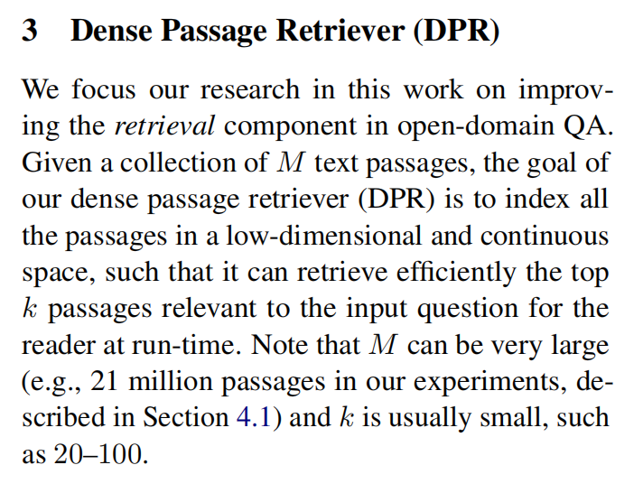

### 2.相关数据集
> 数据集类型:

+ 1. cloze-style(eg. People’s Daily & Children’s Fairy Tale)
+ 2. span-extraction
+ 3. open-domain reading comprehension(dureader)
+ 4. reading comprehension with multiple-choice

> 1.百度
+ dureader-robust
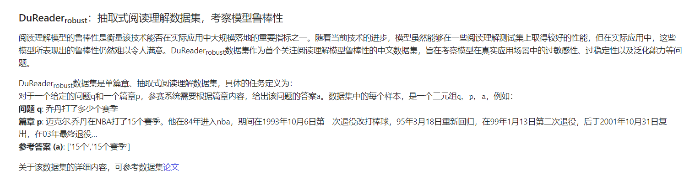

+ dureader-checklist
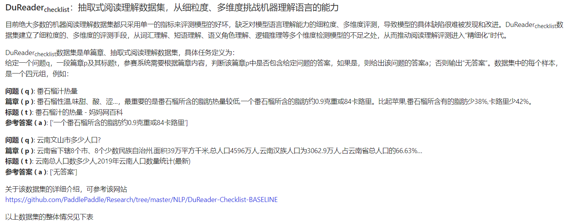
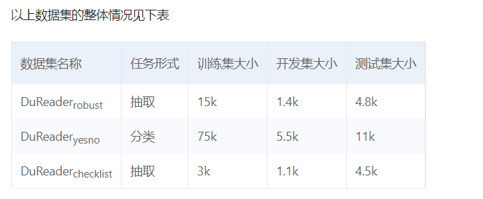
链接：<a href="https://github.com/PaddlePaddle/Research/tree/master/NLP/DuReader-Checklist-BASELINE">点击这里</a>

+ dureader
---
> ChineseNlpCorpus

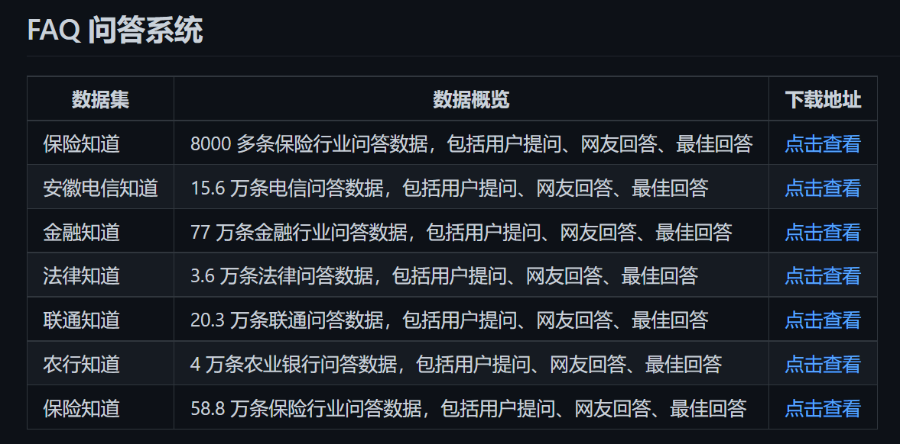
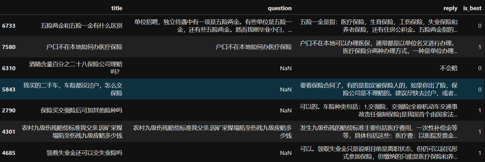
链接：<a href="https://github.com/SophonPlus/ChineseNlpCorpus">点击这里</a>

---

> 2.nlp_chinese_corpus

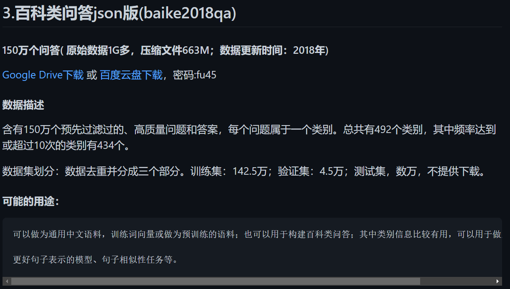
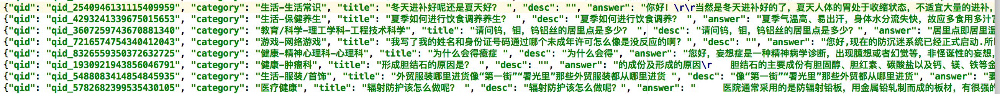

链接：<a href="https://github.com/brightmart/nlp_chinese_corpus">点击这里</a>

---

> 3.CMRC2018

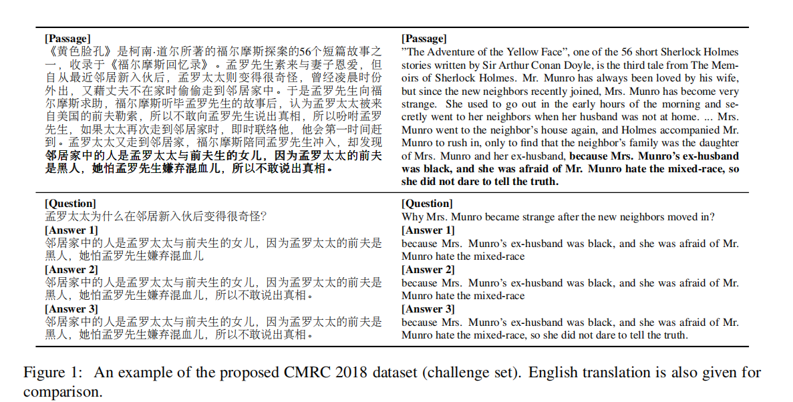

链接：<a href="https://github.com/ymcui/cmrc2018/blob/master/squad-style-data/cmrc2018_dev.json">点击这里</a>

---

> 4.千言数据集网

链接：<a href="https://www.luge.ai/#/">点击这里</a>

### 3.模型
> 1.RAG(**Retrieval-Augmented Generation**)

主要就是用实验验证了retrieve kg的方式要优于让模型直接闭卷考试。在这个模型中文档和query分别用两个bert编码。用FAISS建索引优化MIPS操作。训练数据集就是QA数据集。
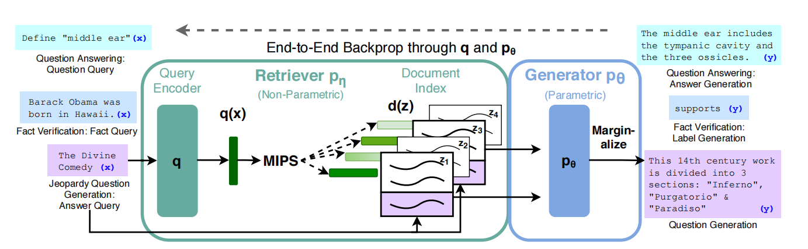

> 2.FID(**Leveraging Passage Retrieval with Generative Modelsfor Open Domain Question Answering**)

retrieval部分与RAG一致，但比较了BM25、TFIDF和DPR得出了后者outperform by large margin。
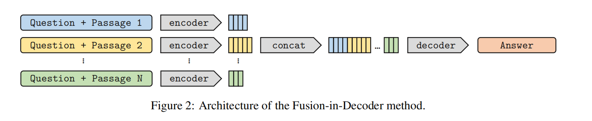

> 3.RetGen(**Joint Retrieval and Generation Training for Grounded Text Generation**)

contribution主要在generator部分，但提出了一种embedding的方式更好区分检索返回的文档和原始输出。
+ 具体来说在词嵌入层设置了不同的token类型来代表token属于文档或者原始输入。同时，为了最大化地分隔x跟z，原始输入x的位置id从0开始算起，而文档y的位置id则是从400开始算起。这有利于生成模型区分开x和z，从而对它们应用不同的策略。
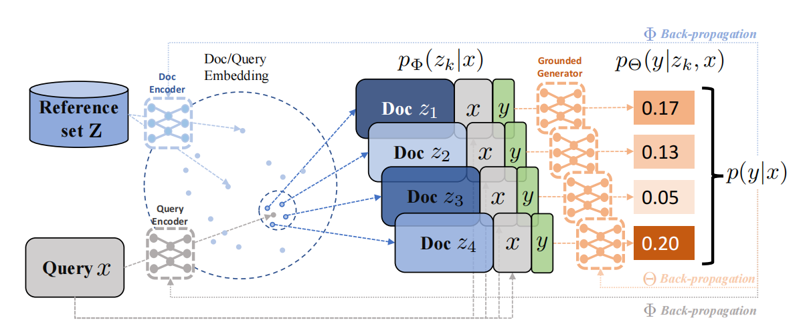

> 4.Greater interaction(**Retrieval Augmentation Reduces Hallucination in Conversation**)

改进full cross-attention的方式，离线算两类DPR，然后在后续阶段实现query和document的交互。

> 5.Poly-encoders(**POLY-ENCODERS: architectures and pre-training strategies for fast and accurate multi-sentence scoring**)

申报书中有描述，目的是减少计算量同时，获得更好的retrieval效果。method就是将query做了m个表征向量然后在后续和document向量做attention，得到最后得分。提出PolyFAISS优化，但我们项目应该不需要。***首创late interaction architecture***
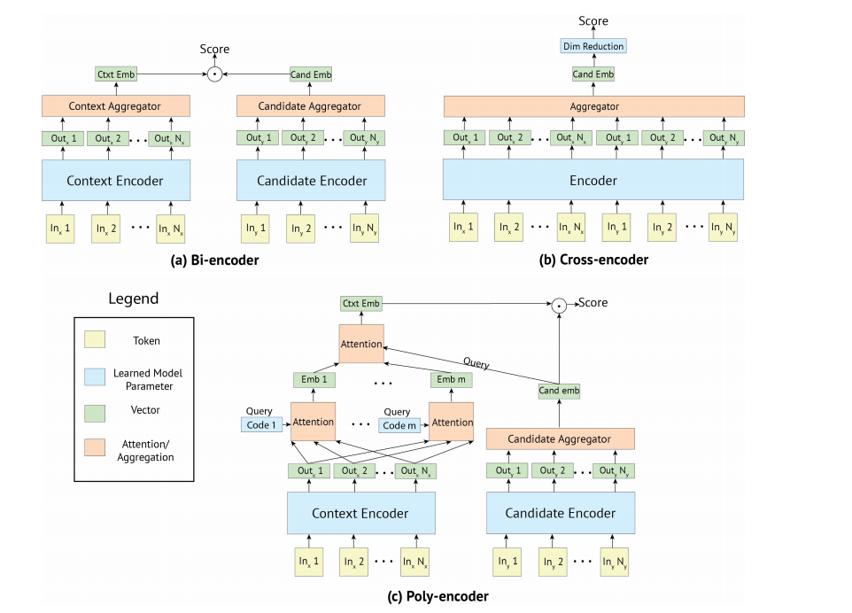

> 6.ColBERT(**ColBERT: Efficient and Effective Passage Search via Contextualized Late Interaction over BERT**)

这篇文章有很多trick，相比于之前工作的主要变化时将每个文档和query都表征成了m个表征向量，具体方式如下。

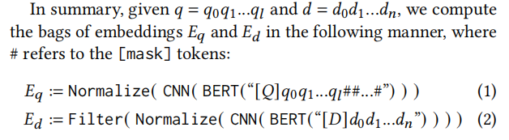

提出了很多优化时间、空间、表达效果的方式，例如迟交互、利用FAISS剪枝、用MaxSim来代替attention、用排序后的batch文档中最大长度做文档的padding、将query的padding用[MASK]填充，实现查询增强等。
**这篇文章中提出了rerank-topk与我们项目需求相似，可以参考**

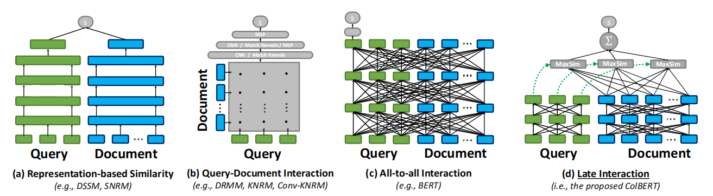

> 7.Iterative retrieval(**Answering Open-Domain Questions of Varying Reasoning Steps from Text**)

这篇文章内容主要就是做多步推理，但因为我们项目知识都比较plain，所以应该用不上。一图胜千言
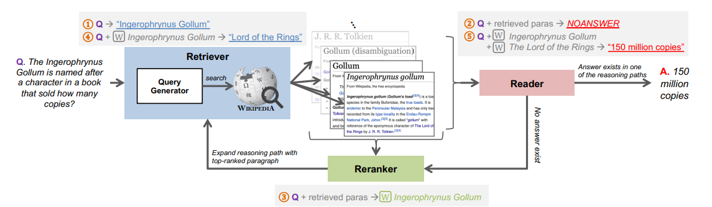

> 8.knn-bert

这个就是用bert做词嵌入之后，找一下query和document的k近邻

